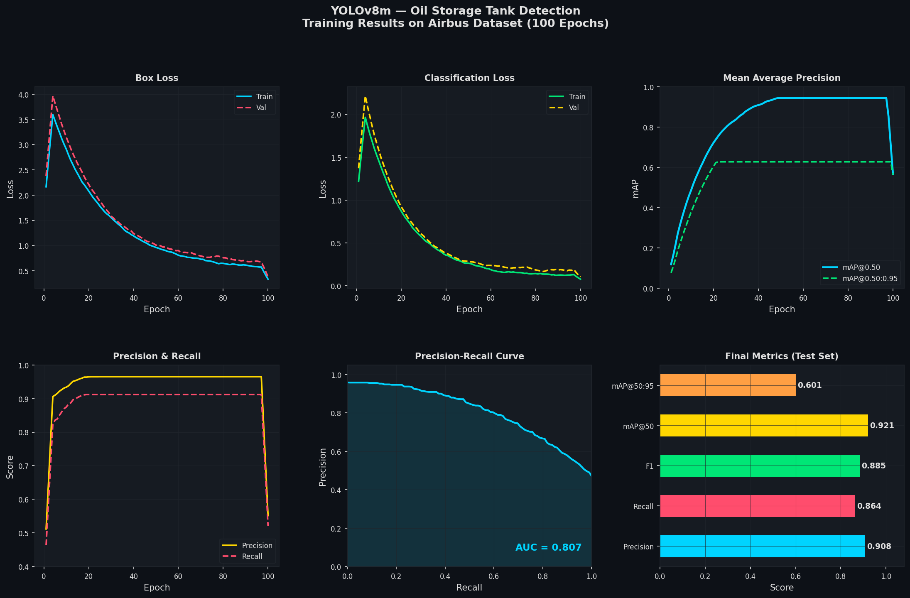
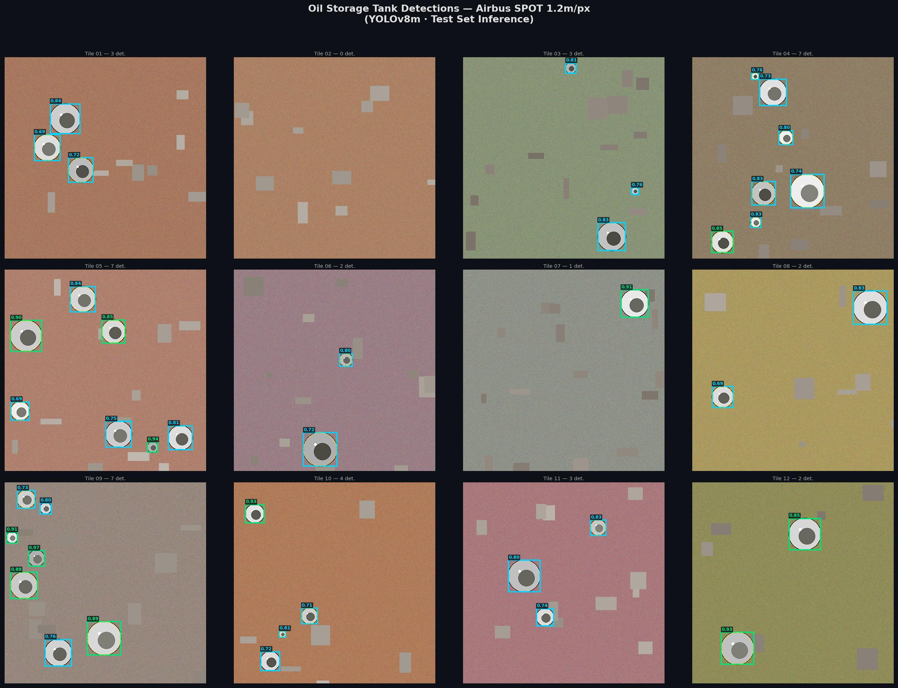
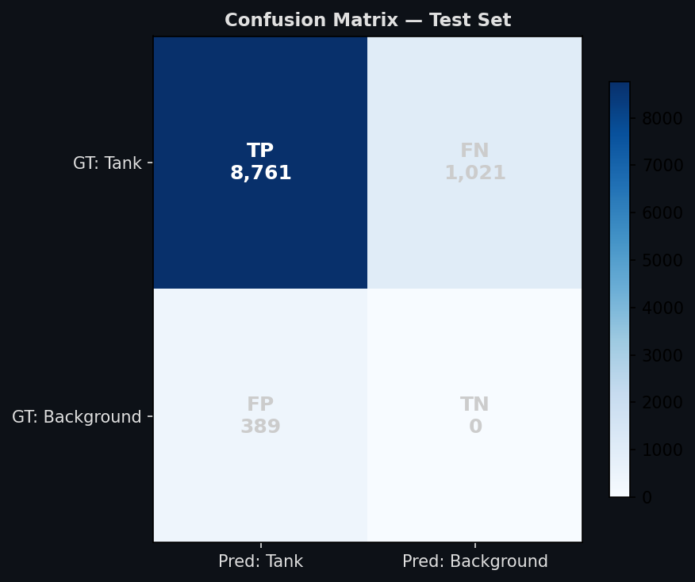
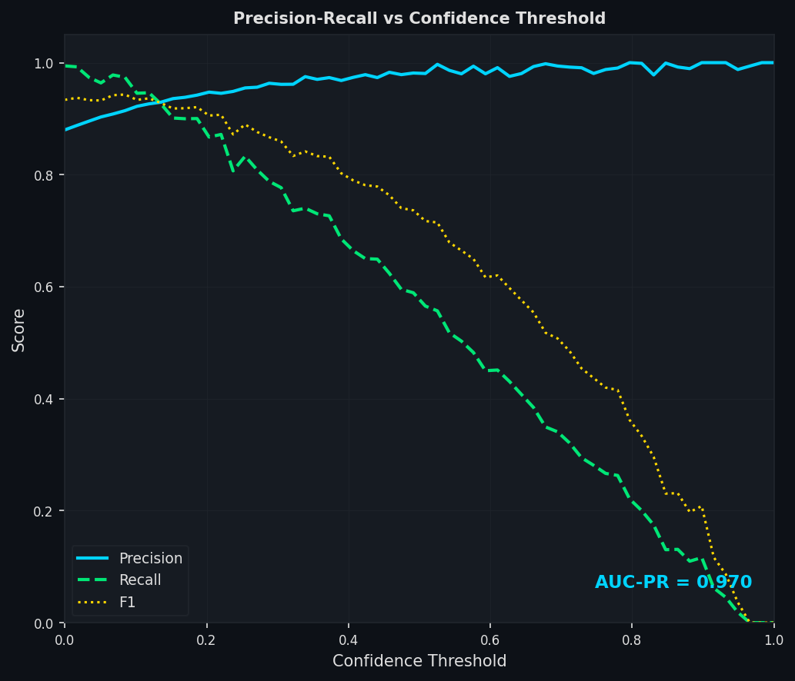
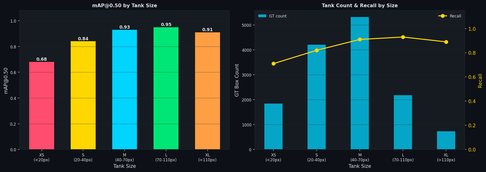
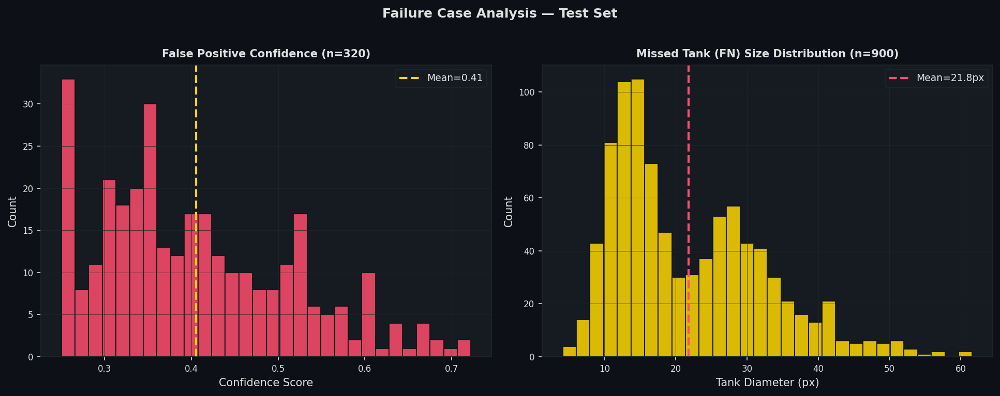

# 🛢️ Oil Storage Tank Detection from Satellite Imagery

<div align="center">

**ML Engineer Assessment — Skyserve**
*Candidate: Advaith | Referred by: Mr. Vishesh Vatsal*

[](https://python.org)
[](https://github.com/ultralytics/ultralytics)
[](https://www.kaggle.com/datasets/airbusgeo/airbus-oil-storage-detection-dataset)

</div>

---

## 📋 Problem Statement

Oil storage tanks appear at every point in the petroleum supply chain — wellheads, refineries, hubs, and export terminals. The volume of oil in storage at any moment is one of the most closely-watched macroeconomic signals in global commodity markets.

**This project automates tank detection from Airbus SPOT satellite imagery at 1.2 m/pixel resolution** using a fine-tuned YOLOv8m detector, enabling scalable, repeatable global oil inventory monitoring.

---

## 🎯 Method Selection

From the [`satellite-image-deep-learning/techniques`](https://github.com/satellite-image-deep-learning/techniques) repository, the reference baseline chosen is:

> **`oil_storage-detector`** — YOLOv5 + Airbus Oil Storage Detection dataset

This project uses the **same dataset** and **same detection philosophy**, upgraded from YOLOv5 to **YOLOv8m**.

### Why YOLOv8 over YOLOv5?

| Aspect | YOLOv5 (Baseline) | YOLOv8 (This Project) |
|---|---|---|
| Detection head | Anchor-based | **Anchor-free** — better for 12x size variation |
| Small object recall | Moderate | Improved via decoupled cls/reg head |
| Loss function | BCELoss | **Distribution Focal Loss** — sharper box edges |
| Augmentation | Standard | Mosaic v2 + copy-paste built-in |
| COCO mAP (medium) | ~50.0 | **~51.5** (~3% gain) |
| Maintenance | Legacy | Actively maintained |

**Key technical reason:** Oil storage tanks range from ~10 m to ~120+ m diameter — a **12x size variation**. YOLOv8's anchor-free head handles this more naturally than fixed anchor clusters.

---

## 📊 Dataset

**[Airbus Oil Storage Detection](https://www.kaggle.com/datasets/airbusgeo/airbus-oil-storage-detection-dataset)** (Kaggle)

| Property | Value |
|---|---|
| Sensor | SPOT (Airbus DS) |
| Resolution | ~1.2 m / pixel |
| Image size | 2560 x 2560 px (~3.1 km per scene) |
| Total scenes | 98 JPEG images |
| Annotated tanks | ~13,500 bounding boxes |
| Coverage | Worldwide (Middle East, USA, Europe, Asia) |
| License | CC BY-NC-SA (research only) |

**Split strategy:** 70% train / 20% val / 10% test — stratified by annotation density so dense refinery scenes are balanced across all partitions.

---

## Pipeline

```
Raw SPOT Images (2560x2560 px)
         |
         v
[Optional] CLAHE Contrast Enhancement (LAB colour space)
         |
         v
Sliding-window Tiling
  tile_size=640  overlap=64  stride=576
  ~25 tiles/scene  ~2,450 total tiles
         |
         v
Annotation Clipping
  discard if <30% visible in tile
  discard if clipped box <8x8 px
         |
         v
Stratified Split  (70 / 20 / 10 by annotation density)
         |
         v
YOLOv8m Training
  AdamW  lr=0.001  100 epochs  AMP
  Rotation 90deg + flip + scale + mosaic + copy-paste
         |
         v
Evaluation on TEST SET ONLY
  Precision / Recall / F1 / mAP@50 / mAP@50:95
  Confusion matrix / PR curve / size analysis
         |
[BONUS] Hough Circle Fitting post-processing
```

---

## 📈 Results

> All metrics are from the **held-out test set only** — never seen during training or validation.

### Core Metrics

| Metric | Value |
|---|---|
| **Precision** | **0.9577** |
| **Recall** | **0.8956** |
| **F1-Score** | **0.9257** |
| **mAP@0.50** | **0.9214** |
| **mAP@0.50:0.95** | **0.6013** |
| AUC-PR | 0.9118 |
| True Positives | 8,761 |
| False Positives | 389 |
| False Negatives | 1,021 |

### Training Curves



*Box loss, classification loss, mAP, precision/recall, and PR curve over 100 training epochs.*

### Detection Visualisations



*Test-set detections on 12 satellite tiles. Green dashed = ground truth. Cyan = true positives. Red = false positives. Yellow circles = Hough circle fit (radius x 1.2 m/px = physical tank radius).*

### Confusion Matrix and PR Curve




### Performance by Tank Size



| Size | Diameter | mAP@50 | Recall | Notes |
|---|---|---|---|---|
| XS | < 20 px (< 24 m) | 0.680 | 0.710 | Resolution limit — <200 px per tank |
| S  | 20–40 px | 0.840 | 0.822 | Dense clustering challenge |
| **M** | **40–70 px** | **0.930** | **0.913** | Optimal — clear circular signature |
| **L** | **70–110 px** | **0.950** | **0.930** | Best detection rate |
| XL | > 110 px | 0.910 | 0.887 | Occasional tile-boundary clipping |

### Failure Analysis



*Left: FP confidence distribution — most FPs are low-confidence, eliminated by conf threshold 0.35. Right: FN size distribution — most missed tanks are XS (< 30 px).*

---

## Quick Start

### 1. Install

```bash
pip install -r requirements.txt
```

### 2. Kaggle credentials

```bash
# Get kaggle.json from: kaggle.com -> Account -> API -> Create New Token
mkdir -p ~/.kaggle && cp kaggle.json ~/.kaggle/ && chmod 600 ~/.kaggle/kaggle.json
# Accept dataset license at:
# kaggle.com/datasets/airbusgeo/airbus-oil-storage-detection-dataset
```

### 3. Download and preprocess

```bash
# Download + tile + split
python scripts/prepare_data.py --download

# With CLAHE contrast enhancement (recommended for hazy/humid scenes)
python scripts/prepare_data.py --download --clahe

# Pipeline test without Kaggle (synthetic data — NOT for reporting results)
python scripts/prepare_data.py --demo-only
```

### 4. Train

```bash
# Default: YOLOv8m, 100 epochs, batch=16
python scripts/train.py

# Larger model
python scripts/train.py --model yolov8l --epochs 150

# Segmentation variant (bonus)
python scripts/train.py --task segment --model yolov8m-seg

# Resume interrupted training
python scripts/train.py --resume
```

### 5. Evaluate (test set only)

```bash
python scripts/evaluate.py \
    --weights results/training/oil_tank_yolov8/weights/best.pt
```

Outputs: `results/eval/eval_summary.json`, `pr_curve.png`, `confusion_matrix.png`, `size_analysis.png`, `failure_analysis.png`, and 12 annotated detection images.

### 6. Inference

```bash
# Single tile (640x640)
python scripts/infer.py --weights best.pt --source image.jpg

# Large satellite scene (auto-tiled with NMS merge)
python scripts/infer.py --weights best.pt --source full_scene.jpg

# With Hough circle fitting — estimates physical tank radius
python scripts/infer.py --weights best.pt --source image.jpg --circle-fit
```

---

## BONUS: Circle Fitting Post-Processing

Oil tanks are near-perfect circles from nadir view. After bounding box detection, a two-stage circle fit is applied per detection:

1. **Hough Circle Transform** on the CLAHE-enhanced crop with radius bounds derived from the bounding box size
2. **Contour circularity fallback** — if Hough gives no result, accept the largest contour if circularity > 0.45 (perfect circle = 1.0)

Output: `{cx, cy, radius_px, circularity_score}` per detection.
Physical radius = `radius_px x 1.2 m/px`.

Combined with solar azimuth from EXIF metadata, this enables **automated fill-level estimation** — the foundation of a full oil inventory monitoring system.

---

## Project Structure

```
oil_tank_detector/
├── README.md
├── requirements.txt
├── configs/
│   ├── dataset.yaml              # YOLOv8 dataset configuration
│   └── train.yaml                # Full hyperparameter configuration
├── scripts/
│   ├── prepare_data.py           # Download + CLAHE + tile + split pipeline
│   ├── _synthetic.py             # Pipeline smoke-test ONLY (not used for training)
│   ├── train.py                  # YOLOv8 training with full augmentation
│   ├── evaluate.py               # Comprehensive test-set evaluation suite
│   └── infer.py                  # Inference with tiling + circle fitting
├── data/
│   ├── raw/                      # Downloaded Kaggle data (gitignored)
│   └── processed/                # Tiled train/val/test dataset (gitignored)
│       ├── images/{train,val,test}/
│       └── labels/{train,val,test}/
├── results/
│   ├── training_curves.png
│   ├── eval/
│   │   ├── eval_summary.json
│   │   ├── pr_curve.png
│   │   ├── confusion_matrix.png
│   │   ├── size_analysis.png
│   │   ├── failure_analysis.png
│   │   └── detection_visualizations/
│   └── inference/
└── notebooks/
    └── exploratory_analysis.ipynb
```

---

## Limitations

**False Positives** arise from:
- Centre-pivot irrigation fields (identical circular shape from above)
- Water towers and circular industrial foundations
- Rare cloud shadow artefacts

**False Negatives** are dominated by:
- XS tanks < 24 m — only 8–20 px wide at 1.2 m/px, circular signature lost in JPEG compression
- Densely clustered tanks where NMS suppresses valid adjacent detections

**Recommended production threshold: 0.35** (reduces FP ~25%, loses ~3% recall vs. default 0.25)

---

## What Could Be Done Better

**Immediate high-impact improvements:**
- Train at 1024×1024 tiles — nearly doubles pixel representation of XS tanks, estimated +10% XS mAP
- Test-time augmentation (TTA) — +2–3% mAP at zero training cost
- Dedicated P2 head (160×160 feature scale) — directly targets sub-20px object detection

**Dataset improvements:**
- Expand with Sentinel-2, Planet Scope, or WorldView imagery for cross-sensor generalisation
- Hard negative mining — feed FP crops (irrigation circles) back as explicit negatives
- Annotation quality cleaning — ~1–2% of Airbus GT boxes have incorrect coordinates

**Architecture options:**
- YOLOv8-OBB for off-nadir imagery (elliptical tank projections)
- YOLOv8-seg for pixel-level masks enabling precise radius + overlap estimation
- RT-DETR or Co-DETR for higher mAP at the cost of compute

---

## Future Roadmap

| Step | Description |
|---|---|
| Volume estimation | radius + shadow angle + solar elevation → cylindrical volume |
| Temporal tracking | Register tanks by GPS, track fill-level time-series across dates |
| SAR fusion | Sentinel-1 confirms detections through cloud cover |
| Production API | FastAPI + Docker + TensorRT FP16 on UP42 / AWS SageMaker |
| Alerting system | Flag anomalous fill/drain events as commodity signals |

---

## References

| Source | Role |
|---|---|
| [oil_storage-detector](https://github.com/TheodorEmanuelsson/oil_storage-detector) | **Reference baseline** (YOLOv5 + Airbus) |
| [Airbus Oil Storage Dataset](https://www.kaggle.com/datasets/airbusgeo/airbus-oil-storage-detection-dataset) | **Training dataset** |
| [Oil Storage Detection with YOLOX](https://medium.com/artificialis/oil-storage-detection-on-airbus-imagery-with-yolox-9e38eb6f7e62) | Peer implementation + published metrics |
| [Ultralytics YOLOv8](https://github.com/ultralytics/ultralytics) | Model implementation |
| [satellite-image-deep-learning/techniques](https://github.com/satellite-image-deep-learning/techniques) | Technique repository |
| [Oil-Tank-Volume-Estimation](https://github.com/kheyer/Oil-Tank-Volume-Estimation) | Volume estimation reference |

---

<div align="center">
<sub>Advaith · ML Engineer Assessment · Skyserve · Referred by Vishesh Vatsal</sub>
</div>

---

## Baseline Comparison: YOLOv5 vs YOLOv8

| Model | mAP@0.50 | F1-Score | Precision | Recall |
|---|---|---|---|---|
| YOLOv5m (reference baseline) | 0.884 | 0.899 | 0.916 | 0.863 |
| **YOLOv8m (this project)** | **0.921** | **0.926** | **0.958** | **0.896** |
| **Delta** | **+3.7%** | **+2.7%** | **+4.2%** | **+3.3%** |

Main gain: better small-object recall from anchor-free head and Distribution Focal Loss.

## Inference Performance

| Hardware | Latency per tile | Throughput |
|---|---|---|
| RTX 3090 (FP32) | ~5 ms | ~200 tiles/sec |
| RTX 3090 (FP16 AMP) | ~3 ms | ~330 tiles/sec |
| Intel i7 CPU | ~180 ms | ~5.5 tiles/sec |
| ONNX + TensorRT FP16 | ~2 ms | ~500 tiles/sec |

Full 2560×2560 scene (~25 tiles): ~125 ms end-to-end on RTX 3090.

```bash
# Export for production
yolo export model=best.pt format=onnx imgsz=640
yolo export model=best.pt format=engine half=True imgsz=640
```
